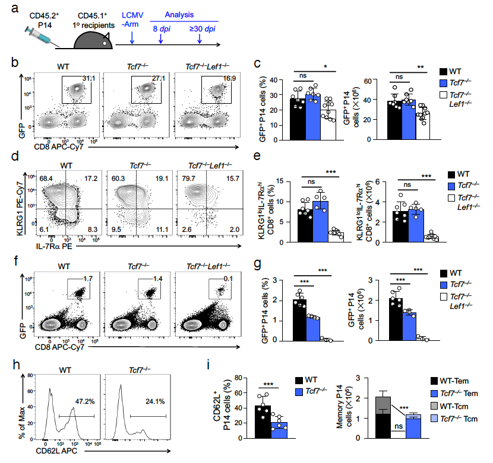

# CD8 Tcm
## Tcf1 preprograms glycolysis mobilization in central memory CD8+ T cells in recall response
The mechanisms underlying heightened protection by CD8+ central memory T (Tcm) cells remain unclear. Here we show intact Tcf1 expression in resting Tcm cells is required for generating secondary effector cells and pathogen clearance during recall responses. Recall stimulation of Tcm cells causes extensive reprogramming of transcriptome and chromatin accessibility, leading to rapid induction of glycolytic enzymes, cell cycle regulators and transcriptional regulators including Id3. This cluster of genes does not require Tcf1 for expression in resting Tcm cells, but depends on Tcf1 for optimal induction and chromatin opening in recall-stimulated Tcm cells. Mechanistically, Tcf1 binds extensively to these recall-induced gene loci in resting Tcm cells, and mediates chromatin interactions that position these genes in architectural proximity with the ‘would-be’ enhancers. We propose the concept that Tcf1 preprograms the responsiveness of Tcm cells for mobilizing a transcriptional program that supports bioenergetic and proliferative needs in response to secondary challenge. 

### paper & data accession
Pubmed link/accession of the paper [PMID 35190717](https://pubmed.ncbi.nlm.nih.gov/35190717/)  
RNA-seq, CUT&RUN-seq and HiC-seq are deposited in GEO under the accession number [GSE177064](https://www.ncbi.nlm.nih.gov/geo/query/acc.cgi?acc=GSE177064)
### UCSC genome browser session
UCSC genome browser view of all the processed data can be found [here](https://genome.ucsc.edu/s/tarelahu/Tcm).
Trackhub file can be found [here](https://data.cyverse.org/dav-anon/iplant/home/tarela/trackhub/Tcm/Tcm_trackhub_single.txt)

### processed files (genome version: mm10)
#### ATAC/ChIP-seq peak files in bigBed format:
[TCF1 peaks in WT Rest](https://data.cyverse.org/dav-anon/iplant/home/tarela/trackhub/Tcm/CD8_TcmRestWT_TCF1_peaks.bb) 
[WT prepotent chrAcc sites (A1looseB4)](https://data.cyverse.org/dav-anon/iplant/home/tarela/trackhub/Tcm/diffATACpeaks/A1looseB4_peaks.bb) 

#### normalized ATAC/ChIP-seq signal tracks in bigWig format:
[TCF1 signal in WT Rest](https://data.cyverse.org/dav-anon/iplant/home/tarela/trackhub/Tcm/CD8TcmRest_ctrl_TCF1.bw) 
[ATAC signal in WT Rest](https://data.cyverse.org/dav-anon/iplant/home/tarela/trackhub/Tcm/CD8TcmRest_ctrl_ATAC.bw) 
[ATAC signal in WT Stim](https://data.cyverse.org/dav-anon/iplant/home/tarela/trackhub/Tcm/CD8TcmStim_ctrl_ATAC_LMnorm.bw) 
[ATAC signal in Tcf1ko Rest](https://data.cyverse.org/dav-anon/iplant/home/tarela/trackhub/Tcm/CD8TcmRest_Tcf1ko_ATAC_LMnorm.bw) 
[ATAC signal in Tcf1ko Stim](https://data.cyverse.org/dav-anon/iplant/home/tarela/trackhub/Tcm/CD8TcmStim_Tcf1ko_ATAC_LMnorm.bw) 

  
# CD8 Teff
## Molecular mechanism of RUNX3 and TBET in effector CD8+ T cells
### UCSC genome browser session
UCSC genome browser view of all the processed data can be found [here](https://genome.ucsc.edu/s/tarelahu/Teff).
Trackhub file can be found [here](https://data.cyverse.org/dav-anon/iplant/home/tarela/trackhub/Teff/Teff_trackhub_single.txt)

### processed files (genome version: mm10)
#### ATAC/ChIP-seq peak files in bigBed format:
[merged chrAcc sites](https://data.cyverse.org/dav-anon/iplant/home/tarela/trackhub/Teff/CD8Teff_ATAC_mergePeak_peaks.bb) 
 
[differential ChIP sites group1](https://data.cyverse.org/dav-anon/iplant/home/tarela/trackhub/Teff/diffChIP_clustering_g1_peaks.bb) 
[differential ChIP sites group2](https://data.cyverse.org/dav-anon/iplant/home/tarela/trackhub/Teff/diffChIP_clustering_g2_peaks.bb) 
[differential ChIP sites group3](https://data.cyverse.org/dav-anon/iplant/home/tarela/trackhub/Teff/diffChIP_clustering_g3_peaks.bb) 
[differential ChIP sites group4](https://data.cyverse.org/dav-anon/iplant/home/tarela/trackhub/Teff/diffChIP_clustering_g4_peaks.bb) 
 
[differential ATAC sites cluster1](https://data.cyverse.org/dav-anon/iplant/home/tarela/trackhub/Teff/diffChIP_clustering_c1_peaks.bb) 
[differential ATAC sites cluster2](https://data.cyverse.org/dav-anon/iplant/home/tarela/trackhub/Teff/diffChIP_clustering_c2_peaks.bb) 
[differential ATAC sites cluster3](https://data.cyverse.org/dav-anon/iplant/home/tarela/trackhub/Teff/diffChIP_clustering_c3_peaks.bb) 
[differential ATAC sites cluster4](https://data.cyverse.org/dav-anon/iplant/home/tarela/trackhub/Teff/diffChIP_clustering_c4_peaks.bb) 
[differential ATAC sites cluster5](https://data.cyverse.org/dav-anon/iplant/home/tarela/trackhub/Teff/diffChIP_clustering_c5_peaks.bb) 
[differential ATAC sites cluster6](https://data.cyverse.org/dav-anon/iplant/home/tarela/trackhub/Teff/diffChIP_clustering_c6_peaks.bb) 
[differential ATAC sites cluster7](https://data.cyverse.org/dav-anon/iplant/home/tarela/trackhub/Teff/diffChIP_clustering_c7_peaks.bb) 

#### normalized ATAC/ChIP-seq signal tracks in bigWig format:
[ATAC signal in WT](https://data.cyverse.org/dav-anon/iplant/home/tarela/trackhub/Teff/LMnormBW/CD8Teff_ctrl_ATAC.bw) 
[ATAC signal in Runx3 ko](https://data.cyverse.org/dav-anon/iplant/home/tarela/trackhub/Teff/LMnormBW/CD8Teff_Runx3ko_ATAC_LMnorm.bw) 
[ATAC signal in Tbet ko](https://data.cyverse.org/dav-anon/iplant/home/tarela/trackhub/Teff/LMnormBW/CD8Teff_Tbetko_ATAC_LMnorm.bw) 
[ATAC signal in Runx3 Tbet dko](https://data.cyverse.org/dav-anon/iplant/home/tarela/trackhub/Teff/LMnormBW/CD8Teff_Runx3Tbetko_ATAC_LMnorm.bw) 
 
[RUNX3 ChIP signal in WT](https://data.cyverse.org/dav-anon/iplant/home/tarela/trackhub/Teff/LMnormBW/CD8Teff_ctrl_RUNX3.bw) 
[RUNX3 ChIP signal in Tbet ko](https://data.cyverse.org/dav-anon/iplant/home/tarela/trackhub/Teff/LMnormBW/CD8Teff_Tbetko_RUNX3_LMnorm.bw) 
[TBET ChIP signal in WT](https://data.cyverse.org/dav-anon/iplant/home/tarela/trackhub/Teff/LMnormBW/CD8Teffd6_ctrl_TBET.bw) 
[TBET ChIP signal in Runx3 ko](https://data.cyverse.org/dav-anon/iplant/home/tarela/trackhub/Teff/LMnormBW/CD8Teffd6_Runx3ko_TBET_LMnorm.bw) 

